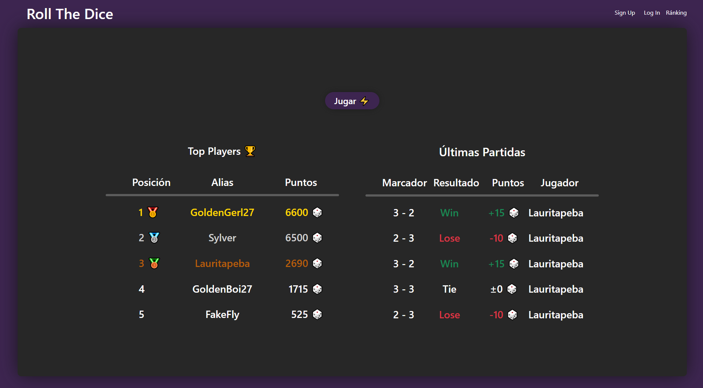
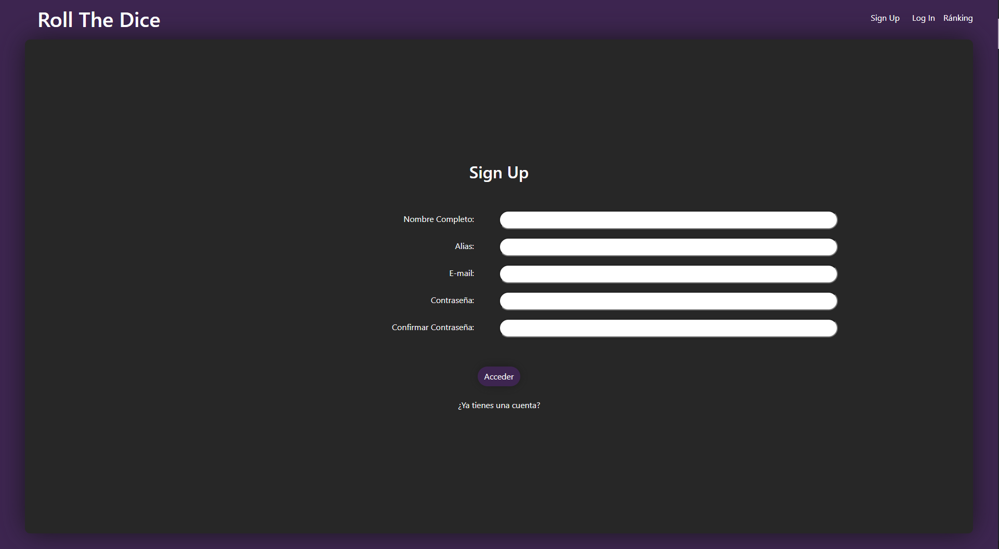
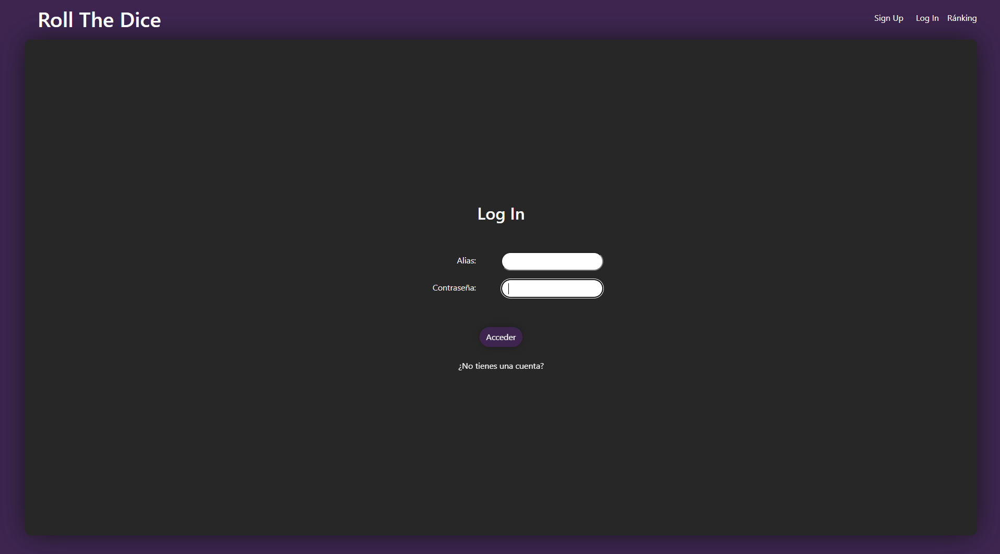
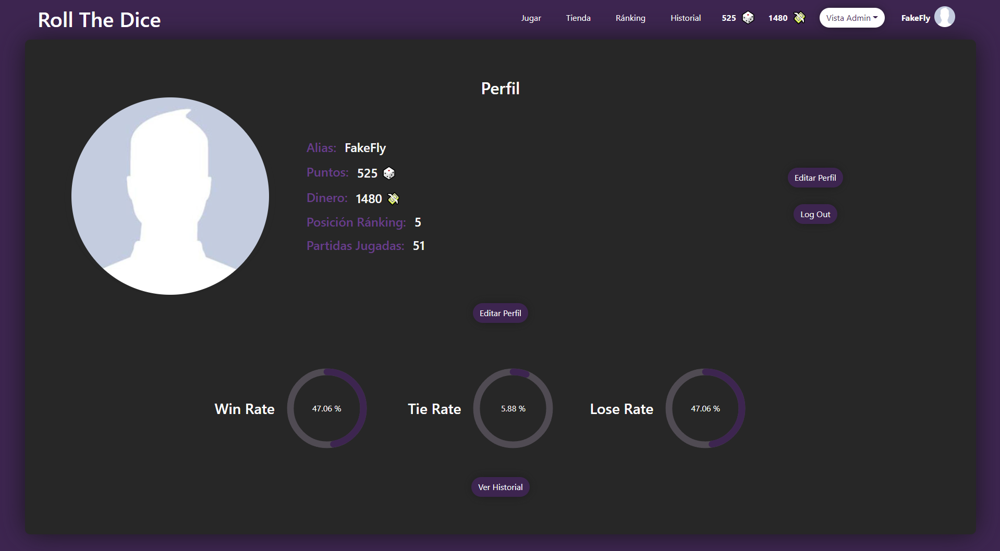
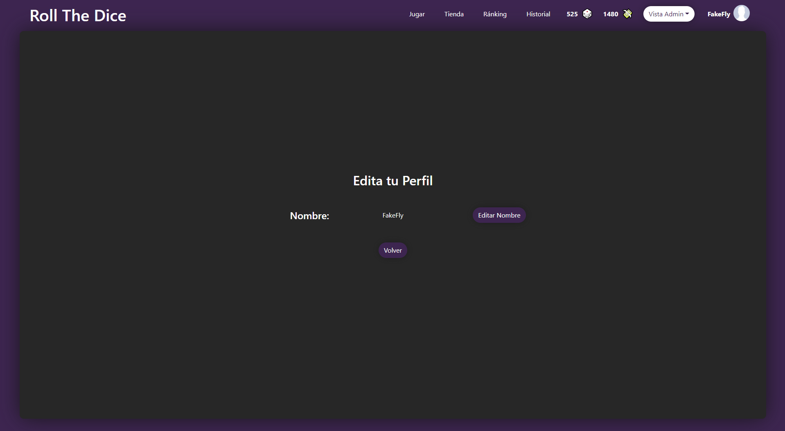
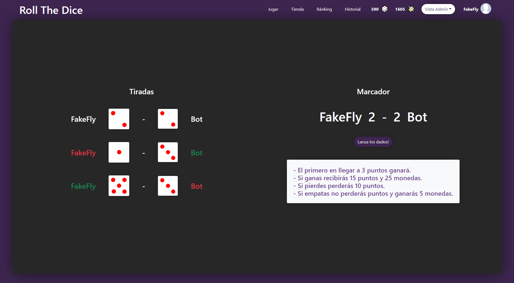
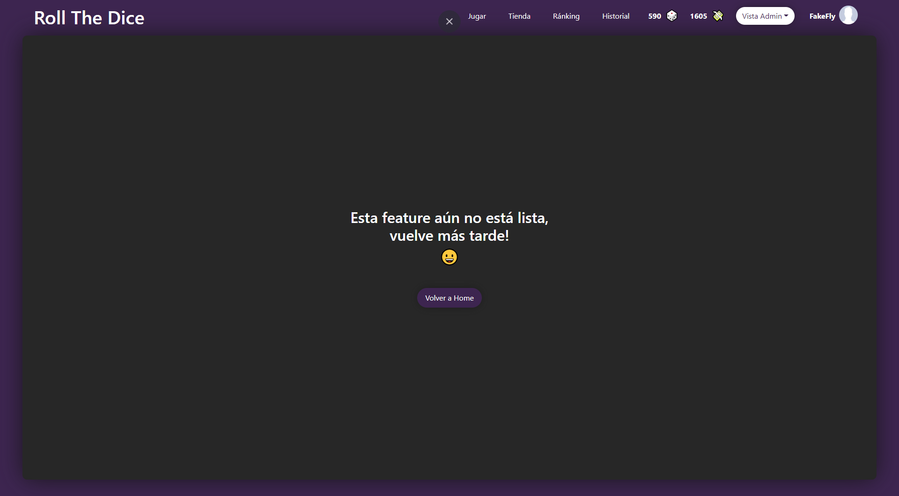
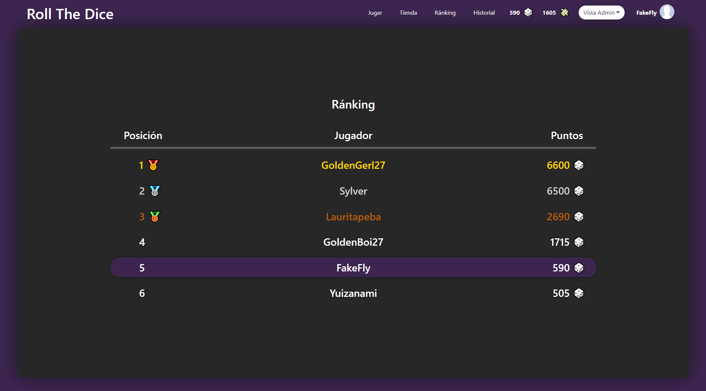
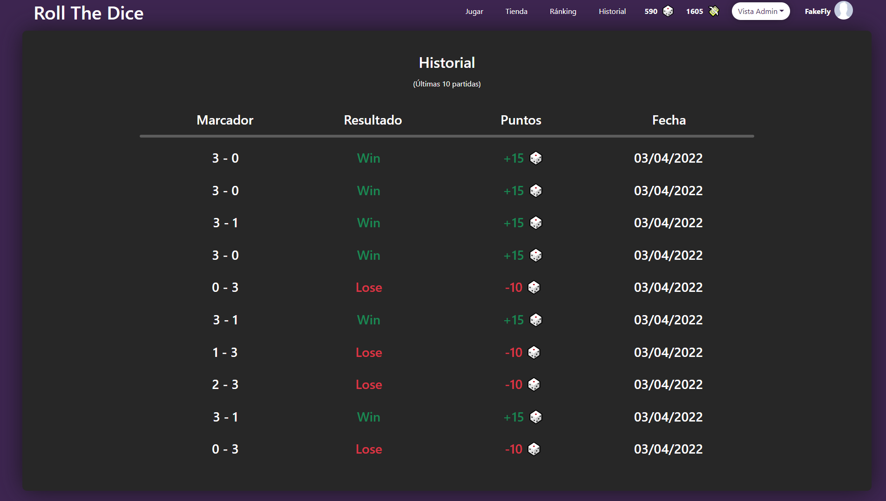
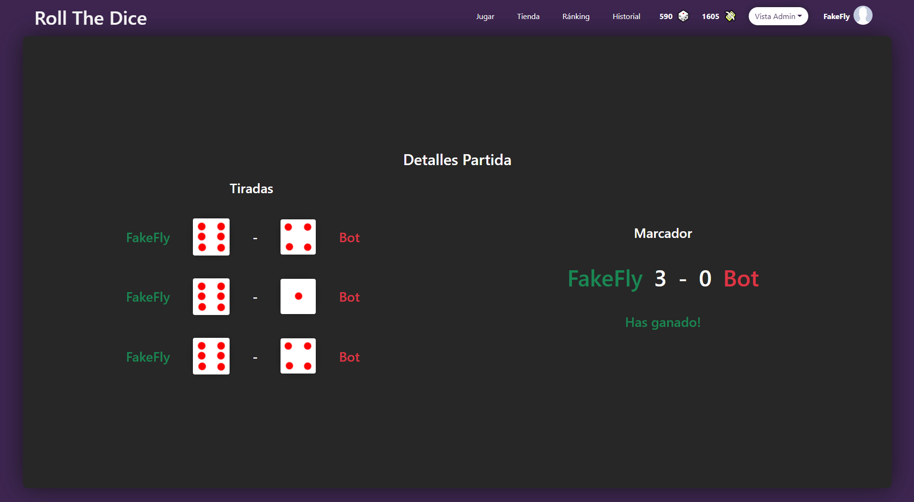

# ProyectoBackend_BuscadorDePeliculas

Se trata de un minijuego en el que deberás lanzar dados contra un bot para ver quien logrará ganar así consiguiendo puntos con los que compararte en un ránking contra los demás jugadores y monedas con las que podrás comprar boosts o nuevas skins para tus dados en la tienda.

### App deployeada en Heroku

[-- ROLL THE DICE --](https://roll-the-dice-app.herokuapp.com/)

<br/> 

### Instalación 🔧

<br/>

_( Antes de proceder a la instalación de ésta aplicación deberás instalarte el siguiente repositorio:_

[Repositorio Backend](https://github.com/AxelUrizar/RollTheDice-Backend.git) )

_Para instalar el proyecto deberás copiar en tu disco local el siguiente repositorio de GitHub con el siguiente comando:_

```
git clone https://github.com/AxelUrizar/RollTheDice-Frontend.git
```

_Tras lo cual tendremos que installar las dependencias con:_

```
npm install
```
o

```
yarn install
```

Y por último será necesario añadir las siguientes variables de entorno en un documento ".env".

```
API_URL_START=(URL hacia la API a la que se harán las peticiones)
```
<br/>

## Entrando en la aplicación ⚙️
<br/>

* Home

_Al entrar en la aplicación por primera vez podrás encontrar la página de landing en la que se mostrarán distintas cosas como un Top 5 de los jugadores en ese momento, las últimas partidas jugadas y un botón para acceder al area de juego en el que podrás tirar los dados._



* Sign Up

_Si deseas jugar al juego tendras que registrarte insertando tu información._



* Log In

_Si ya tienes una cuenta puedes logearte clicando en el botón para jugar sin estarlo antes, desde la barra superior o usando el botón de redirección que existe en el SignUp._



* Perfil

_Una vez logueado podrás entrar a tu perfil donde obtendrás información sobre ti como tu alias, tus puntos, el dinero ganado, tu posición en el ranking, tus partidas jugadas, tus porcentajes de victoria y las últimas pártidas jugadas así como dos botónes extra, uno para editar tu perfil y otro para desloguearte._



* Editar perfil

_Desde aquí podrás editar tu alias._



* Partida

_Aquí podrás comenzar a jugar lanzando tus dados con el botón definido para ello y observando a tiempo real el contador de la ronda_



* Tienda

_Este apartado aún está en proceso de creación._



* Ránking

_Aquí podrás ver el ránking de jugadores con sus respectivos puntos pudiendo clickar en ellos para ver sus respectivos perfiles siendo tu posición diferenciada por color respecto al resto para mayor facilidad a la hora de encontrarse._



* Historial

_En el historial (al igual que en tu perfil) podrás ver tus ultimas 10 partidas pudiendo clickar en ellas para ver los detalles de estas._



* Detalles Partida Historial

_Aquí se mostrarán los detalles de la partida._



* Usuarios vistos por un Admin

_Usando en apartado especial de usuarios al que solo pueden entrar los administradores podremos ver algo más de información extra de estos._

(Correos censurados para proteger la integridad de los jugadores actuales)


## Construido con 🛠️

* Javascript
* React
* Redux
* Bootstrap

## Autores ✒️

* **Axel Urizar** - [GitHub](https://github.com/AxelUrizar)